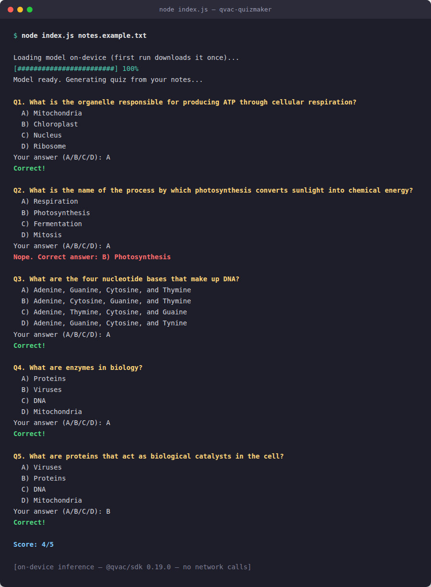

# qvac-quizmaker

Turn any local notes file into a 5-question multiple-choice quiz — entirely on-device, using [Tether's QVAC SDK](https://github.com/tetherto/qvac). No API key, no server call, no bill. Your notes never leave your machine.

## What it does

Point it at a `.txt` file of notes. It loads a small local LLM via QVAC (`loadModel`), asks the model to write a quiz from your notes (`completion`), then quizzes you interactively in the terminal and scores you at the end.

**QVAC functions used:** `loadModel` and `completion` (streaming).



## Why I built it

Flashcard apps make you write the questions yourself. This writes them for you, from notes you already have, without sending them anywhere.

## Requirements

- Node.js >= 18
- `@qvac/sdk` `^0.19.0` (installed automatically via `npm install`)

## Install

```bash
git clone https://github.com/romzxyz123456789-droid/qvac-quizmaker.git
cd qvac-quizmaker
npm install
```

## Run

```bash
node index.js notes.example.txt
```

On first run, QVAC downloads the model (`LLAMA_3_2_1B_INST_Q4_0`) once and caches it locally. Every run after that is fully offline.

Use your own notes:

```bash
node index.js /path/to/your-notes.txt
```

Answer each question with `A`/`B`/`C`/`D` and press Enter. Your score prints at the end.

## SDK version used

`@qvac/sdk` `0.19.0`

## License

MIT — see [LICENSE](LICENSE).
